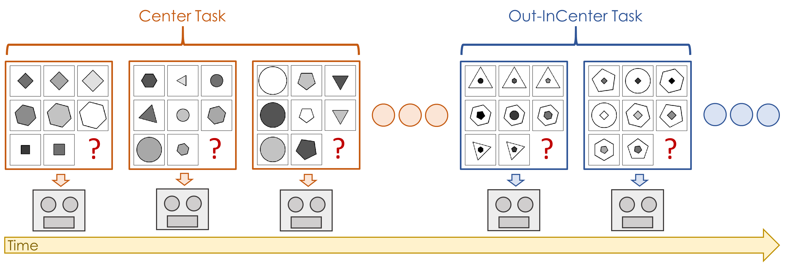
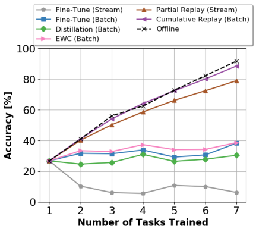

Selective Replay Enhances Learning in Online Continual Analogical Reasoning
=====================================
This is PyTorch code for our CVPRW (CLVISION) 2021 paper available on [arXiv](https://arxiv.org/abs/2103.03987).

We study continual learning of analogical reasoning. Analogical reasoning tests such as Raven’s Progressive Matrices 
(RPMs) are commonly used to measure non-verbal abstract reasoning in humans, and recently offline neural networks for 
the RPM problem have been proposed. In this paper, we establish experimental baselines, protocols, and forward and backward
transfer metrics to evaluate continual learners on RPMs. We employ experience replay to mitigate catastrophic forgetting. 
Prior work using replay for image classification tasks has found that selectively choosing the samples to replay offers 
little, if any, benefit over random selection. In contrast, we find that selective replay can significantly outperform 
random selection for the RPM task.


A demonstration of our training protocol on RAVEN [[1]](#1). At each time-step, a streaming learner receives a single 
new example from a particular task. It learns the new example and then can be subsequently evaluated.

This codebase builds on the RAVEN [[1]](#1) and Rel-AIR [[2]](#2) codebases.

## Dependencies
We have tested the code with the following packages and versions:
- Python 3.7.7
- PyTorch (GPU) 1.6.0
- torchvision 0.7.0 
- tensorboardX 1.14.0
- cv2 4.4.0
- tqdm 4.59.0
- CUDA 10.2
- NVIDIA GPU

We recommend setting up a `conda` environment with these same package versions:
```
conda create -n continual_analogical_reasoning python=3.7.7
conda activate continual_analogical_reasoning
pip install tensorboardX
pip install opencv-python
pip install tqdm
conda install pytorch==1.6.0 torchvision==0.7.0 cudatoolkit=10.2 -c pytorch
```

## Setup the Dataset
All experiments were run on the RAVEN-10K dataset [[1]](#1), which can be downloaded here: http://wellyzhang.github.io/project/raven.html#dataset

Following [[2]](#2), we resize all images in the dataset to 80x80 (half-size) and save out a smaller version of the dataset.
This pre-processing can be done by calling [setup_dataset.py](./src/model/setup_dataset.py) with `--path` defined as 
the path to the original image directory and `--new_path` as the directory where the smaller images will be saved.

## Training Models
Our base directory structure follows the original RAVEN and Rel-AIR repositories. Beyond this, we have added the folder 
[continual_learning](./src/model/continual_learning), which contains the files necessary to replicate our paper results.

In the folder [bash_scripts](./src/model/continual_learning/bash_scripts), we have provided bash scripts to run each 
experiment as follows:
- [run_main_experiments.sh](./src/model/continual_learning/bash_scripts/run_main_experiments.sh)
  - Trains the Fine-Tune (Stream), Fine-Tune (Batch), Distillation, EWC, and Cumulative Replay baselines on the 3 dataset 
    orderings provided in our paper.
    
- [run_selective_replay_experiments.sh](./src/model/continual_learning/bash_scripts/run_selective_replay_experiments.sh)
  - Trains the Partial Replay model with all 7 replay selection policies in both the unbalanced and balanced setup with 
    32 replay samples per mini-batch on the 3 dataset orderings.
    
- [partial_replay_sample_size_ablation.sh](./src/model/continual_learning/bash_scripts/partial_replay_sample_size_ablation.sh)
  - Performs ablation study with the Partial Replay model with all 7 replay selection policies in the unbalanced setting 
  with {8, 16, 64} replay samples per mini-batch on the 3 dataset orderings.
    
- [tune_regularization_models.sh](./src/model/continual_learning/bash_scripts/tune_regularization_models.sh)
  - Grid searches the regularization parameter for the Distillation and EWC models on a single dataset ordering.
  
*Note:* For convenience, we have provided pre-trained checkpoint files for the offline base initialization 
phase for each of our 3 dataset orderings in the folder [checkpoints](./src/model/checkpoints). We have also provided 
all offline model accuracies for each dataset ordering in the script [evaluate_results.py](./src/model/continual_learning/evaluate_results.py)
(`get_offline_array`). If you would instead like to train the offline checkpoint files from scratch, use the following:
- [train_single_task_experts_base_init.sh](./src/model/continual_learning/bash_scripts/train_single_task_experts_base_init.sh)
  - This script will train the offline base initialization checkpoint for each of our dataset orderings.
  
- [train_all_offline_experts.sh](./src/model/continual_learning/bash_scripts/train_all_offline_experts.sh)
  - This script will train the remaining offline models for each of our dataset orderings.
  
## Evaluating Models
During training, our scripts save out the following results for each model:
- Final model checkpoint (`final_ckpt.pth`)
- Final test set probabilities produced by the model (`final_probas.pth`)
- Final ground-truth test set predictions (`final_true_labels.pth`)
- Incremental performance at the end of each task on all tasks (`incremental_raven_accuracies.json`)

To compute the performance metrics from our paper, we have provided the script [evaluate_results.py](./src/model/continual_learning/evaluate_results.py).
By setting the appropriate path parameters, this script will compute the Omega, Average Accuracy, Forward Transfer, 
Backward Transfer, and Total Compute Time metrics from these saved files. Additionally, this script will plot/save the 
learning curve for all baseline models, as well as the plot of the Partial Replay model Omega performance as a function 
of the number of replay samples.



The script [gather_offline_results.sh](./src/model/continual_learning/bash_scripts/gather_offline_results.sh) can be 
used to evaluate offline model performance.

## References 
<a id="1">[1]</a> Chi Zhang, Feng Gao, Baoxiong Jia, Yixin Zhu, and Song-Chun Zhu. Raven: A dataset for relational and analogical
visual reasoning. In CVPR, 2019. Code: https://github.com/WellyZhang/RAVEN

<a id="2">[2]</a>  Steven Spratley, Krista Ehinger, and Tim Miller. A closer
look at generalisation in raven. In ECCV, 2020. Code: https://github.com/SvenShade/Rel-AIR
  

## Citation
If using this code, please cite our paper.
```
@InProceedings{Hayes_2021_Continual_Analogical_Reasoning,
    author = {Hayes, Tyler L. and Kanan, Christopher},
    title = {Selective Replay Enhances Learning in Online Continual Analogical Reasoning},
    booktitle = {The IEEE/CVF Conference on Computer Vision and Pattern Recognition (CVPR) Workshops},
    month = {June},
    year = {2021}
}
